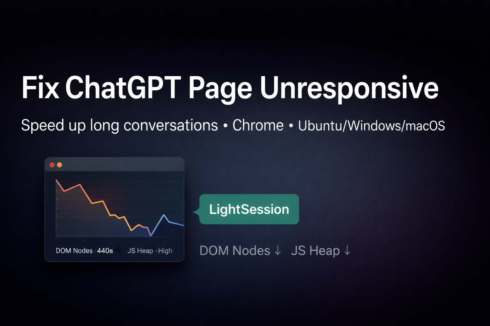

# ChatGPT “Page Unresponsive” Fix (Long Conversations)

Fix ChatGPT freezing / slow scrolling in very long conversations by trimming the rendered DOM (client-side) — **without deleting your real chat history**.

✅ Works best on **Google Chrome** (Windows / macOS / Ubuntu) using automated policy-based installation.

---
<p align="center">
  
</p>
<p align="center">
  <a href="https://github.com/NexuZero/chatgpt-page-unresponsive-fix/stargazers">
    
  </a>
  <a href="https://github.com/NexuZero/chatgpt-page-unresponsive-fix/issues">
    
  </a>
  <a href="https://github.com/NexuZero/chatgpt-page-unresponsive-fix/blob/main/LICENSE">
    
  </a>
  
  
  
  
</p>


## What you get
- ✅ Stops “Page Unresponsive” on huge threads
- ✅ Smooth scrolling + faster typing
- ✅ Automated install (no manual extension clicking) via Chrome policies
- ✅ Verification steps to prove improvement (DOM Nodes / JS heap / tab memory)

---

## The real cause (why it crashes)
Long ChatGPT threads can grow into **hundreds of thousands of DOM nodes** and heavy JS memory usage. That overwhelms the browser UI and causes freezing.

---

## The fix used here
This repo deploys **ChatGPT LightSession** which keeps only the last **N messages** rendered in the UI while you work.

Extension ID:
`fmomjhjnmgpknbabfpojgifokaibeoje`

> Security note: Forced-install policies can auto-install extensions and grant permissions. Use only if you trust the extension.

---

## Quick Start

### Ubuntu (one-command)
Install:
```bash
bash scripts/ubuntu_chrome_install.sh
